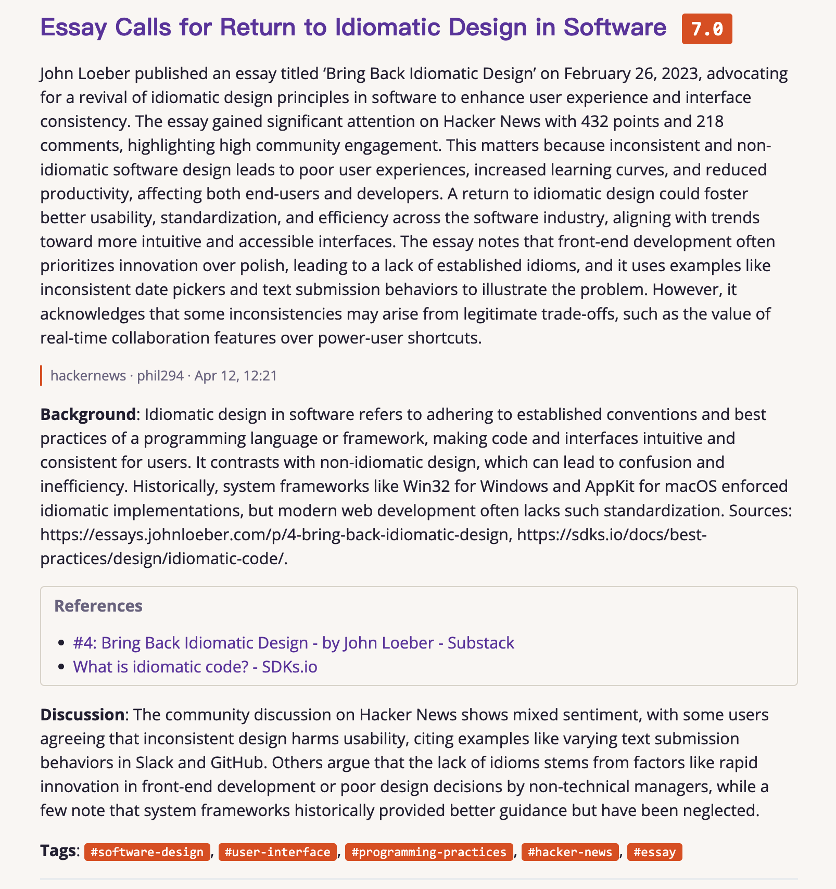
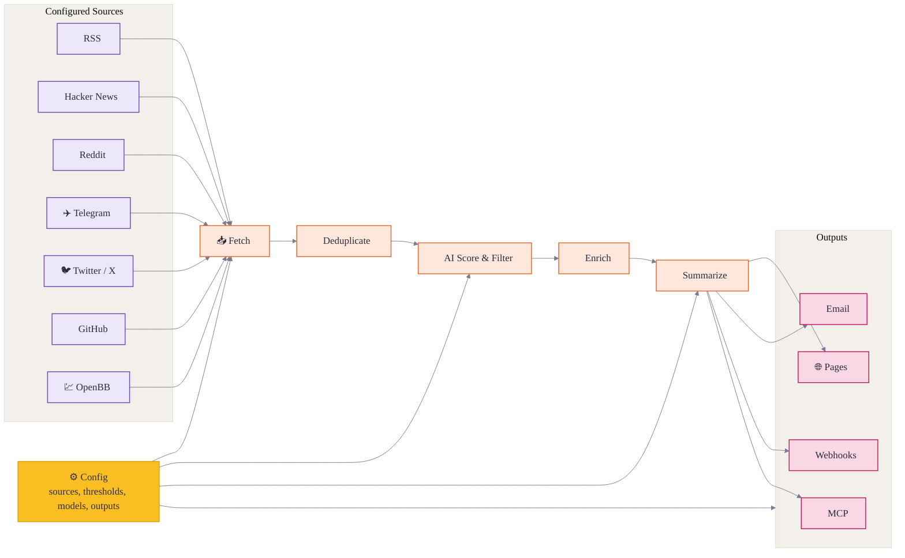

<div align="center">
<h1>🌅 Horizon</h1>

<p><strong>Enjoy the News itself. Leave others to Horizon</strong></p>

<a href="https://trendshift.io/repositories/22864?utm_source=trendshift-badge&amp;utm_medium=badge&amp;utm_campaign=badge-trendshift-22864" target="_blank" rel="noopener noreferrer"></a>
<a href="https://trendshift.io/repositories/22864?utm_source=trendshift-badge&amp;utm_medium=badge&amp;utm_campaign=badge-trendshift-22864" target="_blank" rel="noopener noreferrer"></a>
<a href="https://hellogithub.com/repository/Thysrael/Horizon" target="_blank"></a>
<br>

[](LICENSE)
[](https://github.com/astral-sh/uv)
[](https://www.horizon1123.top/)
[](https://thysrael.github.io/Horizon/)
[](https://github.com/Thysrael/Horizon/commits/main)
[](https://github.com/Thysrael/Horizon/pulls)


![GPT](https://img.shields.io/badge/GPT-10A37F?style=flat-square&logo=data:image/svg%2bxml;base64,PHN2ZyByb2xlPSJpbWciIHZpZXdCb3g9IjAgMCAyNCAyNCIgeG1sbnM9Imh0dHA6Ly93d3cudzMub3JnLzIwMDAvc3ZnIj48cGF0aCBmaWxsPSJ3aGl0ZSIgZD0iTTIyLjI4MTkgOS44MjExYTUuOTg0NyA1Ljk4NDcgMCAwIDAtLjUxNTctNC45MTA4IDYuMDQ2MiA2LjA0NjIgMCAwIDAtNi41MDk4LTIuOUE2LjA2NTEgNi4wNjUxIDAgMCAwIDQuOTgwNyA0LjE4MThhNS45ODQ3IDUuOTg0NyAwIDAgMC0zLjk5NzcgMi45IDYuMDQ2MiA2LjA0NjIgMCAwIDAgLjc0MjcgNy4wOTY2IDUuOTggNS45OCAwIDAgMCAuNTExIDQuOTEwNyA2LjA1MSA2LjA1MSAwIDAgMCA2LjUxNDYgMi45MDAxQTUuOTg0NyA1Ljk4NDcgMCAwIDAgMTMuMjU5OSAyNGE2LjA1NTcgNi4wNTU3IDAgMCAwIDUuNzcxOC00LjIwNTggNS45ODk0IDUuOTg5NCAwIDAgMCAzLjk5NzctMi45MDAxIDYuMDU1NyA2LjA1NTcgMCAwIDAtLjc0NzUtNy4wNzI5em0tOS4wMjIgMTIuNjA4MWE0LjQ3NTUgNC40NzU1IDAgMCAxLTIuODc2NC0xLjA0MDhsLjE0MTktLjA4MDQgNC43NzgzLTIuNzU4MmEuNzk0OC43OTQ4IDAgMCAwIC4zOTI3LS42ODEzdi02LjczNjlsMi4wMiAxLjE2ODZhLjA3MS4wNzEgMCAwIDEgLjAzOC4wNTJ2NS41ODI2YTQuNTA0IDQuNTA0IDAgMCAxLTQuNDk0NSA0LjQ5NDR6bS05LjY2MDctNC4xMjU0YTQuNDcwOCA0LjQ3MDggMCAwIDEtLjUzNDYtMy4wMTM3bC4xNDIuMDg1MiA0Ljc4MyAyLjc1ODJhLjc3MTIuNzcxMiAwIDAgMCAuNzgwNiAwbDUuODQyOC0zLjM2ODV2Mi4zMzI0YS4wODA0LjA4MDQgMCAwIDEtLjAzMzIuMDYxNUw5Ljc0IDE5Ljk1MDJhNC40OTkyIDQuNDk5MiAwIDAgMS02LjE0MDgtMS42NDY0ek0yLjM0MDggNy44OTU2YTQuNDg1IDQuNDg1IDAgMCAxIDIuMzY1NS0xLjk3MjhWMTEuNmEuNzY2NC43NjY0IDAgMCAwIC4zODc5LjY3NjVsNS44MTQ0IDMuMzU0My0yLjAyMDEgMS4xNjg1YS4wNzU3LjA3NTcgMCAwIDEtLjA3MSAwbC00LjgzMDMtMi43ODY1QTQuNTA0IDQuNTA0IDAgMCAxIDIuMzQwOCA3Ljg3MnptMTYuNTk2MyAzLjg1NThMMTMuMTAzOCA4LjM2NCAxNS4xMTkyIDcuMmEuMDc1Ny4wNzU3IDAgMCAxIC4wNzEgMGw0LjgzMDMgMi43OTEzYTQuNDk0NCA0LjQ5NDQgMCAwIDEtLjY3NjUgOC4xMDQydi01LjY3NzJhLjc5Ljc5IDAgMCAwLS40MDctLjY2N3ptMi4wMTA3LTMuMDIzMWwtLjE0Mi0uMDg1Mi00Ljc3MzUtMi43ODE4YS43NzU5Ljc3NTkgMCAwIDAtLjc4NTQgMEw5LjQwOSA5LjIyOTdWNi44OTc0YS4wNjYyLjA2NjIgMCAwIDEgLjAyODQtLjA2MTVsNC44MzAzLTIuNzg2NmE0LjQ5OTIgNC40OTkyIDAgMCAxIDYuNjgwMiA0LjY2ek04LjMwNjUgMTIuODYzbC0yLjAyLTEuMTYzOGEuMDgwNC4wODA0IDAgMCAxLS4wMzgtLjA1NjdWNi4wNzQyYTQuNDk5MiA0LjQ5OTIgMCAwIDEgNy4zNzU3LTMuNDUzN2wtLjE0Mi4wODA1TDguNzA0IDUuNDU5YS43OTQ4Ljc5NDggMCAwIDAtLjM5MjcuNjgxM3ptMS4wOTc2LTIuMzY1NGwyLjYwMi0xLjQ5OTggMi42MDY5IDEuNDk5OHYyLjk5OTRsLTIuNTk3NCAxLjQ5OTctMi42MDY3LTEuNDk5N1oiLz48L3N2Zz4=)


![OpenClaw](https://img.shields.io/badge/OpenClaw-C83232?style=flat-square&logo=data:image/svg%2bxml;base64,PHN2ZyB4bWxucz0iaHR0cDovL3d3dy53My5vcmcvMjAwMC9zdmciIHdpZHRoPSI2NCIgaGVpZ2h0PSI2NCIgdmlld0JveD0iMCAwIDE2IDE2IiBhcmlhLWxhYmVsPSJQaXhlbCBsb2JzdGVyIj4KICA8cmVjdCB3aWR0aD0iMTYiIGhlaWdodD0iMTYiIGZpbGw9Im5vbmUiLz4KICAKICA8ZyBmaWxsPSIjM2EwYTBkIj4KICAgIDxyZWN0IHg9IjEiIHk9IjUiIHdpZHRoPSIxIiBoZWlnaHQ9IjMiLz4KICAgIDxyZWN0IHg9IjIiIHk9IjQiIHdpZHRoPSIxIiBoZWlnaHQ9IjEiLz4KICAgIDxyZWN0IHg9IjIiIHk9IjgiIHdpZHRoPSIxIiBoZWlnaHQ9IjEiLz4KICAgIDxyZWN0IHg9IjMiIHk9IjMiIHdpZHRoPSIxIiBoZWlnaHQ9IjEiLz4KICAgIDxyZWN0IHg9IjMiIHk9IjkiIHdpZHRoPSIxIiBoZWlnaHQ9IjEiLz4KICAgIDxyZWN0IHg9IjQiIHk9IjIiIHdpZHRoPSIxIiBoZWlnaHQ9IjEiLz4KICAgIDxyZWN0IHg9IjQiIHk9IjEwIiB3aWR0aD0iMSIgaGVpZ2h0PSIxIi8+CiAgICA8cmVjdCB4PSI1IiB5PSIyIiB3aWR0aD0iNiIgaGVpZ2h0PSIxIi8+CiAgICA8cmVjdCB4PSIxMSIgeT0iMiIgd2lkdGg9IjEiIGhlaWdodD0iMSIvPgogICAgPHJlY3QgeD0iMTIiIHk9IjMiIHdpZHRoPSIxIiBoZWlnaHQ9IjEiLz4KICAgIDxyZWN0IHg9IjEyIiB5PSI5IiB3aWR0aD0iMSIgaGVpZ2h0PSIxIi8+CiAgICA8cmVjdCB4PSIxMyIgeT0iNCIgd2lkdGg9IjEiIGhlaWdodD0iMSIvPgogICAgPHJlY3QgeD0iMTMiIHk9IjgiIHdpZHRoPSIxIiBoZWlnaHQ9IjEiLz4KICAgIDxyZWN0IHg9IjE0IiB5PSI1IiB3aWR0aD0iMSIgaGVpZ2h0PSIzIi8+CiAgICA8cmVjdCB4PSI1IiB5PSIxMSIgd2lkdGg9IjYiIGhlaWdodD0iMSIvPgogICAgPHJlY3QgeD0iNCIgeT0iMTIiIHdpZHRoPSIxIiBoZWlnaHQ9IjEiLz4KICAgIDxyZWN0IHg9IjExIiB5PSIxMiIgd2lkdGg9IjEiIGhlaWdodD0iMSIvPgogICAgPHJlY3QgeD0iMyIgeT0iMTMiIHdpZHRoPSIxIiBoZWlnaHQ9IjEiLz4KICAgIDxyZWN0IHg9IjEyIiB5PSIxMyIgd2lkdGg9IjEiIGhlaWdodD0iMSIvPgogICAgPHJlY3QgeD0iNSIgeT0iMTQiIHdpZHRoPSI2IiBoZWlnaHQ9IjEiLz4KICA8L2c+CgogIAogIDxnIGZpbGw9IiNmZjRmNDAiPgogICAgPHJlY3QgeD0iNSIgeT0iMyIgd2lkdGg9IjYiIGhlaWdodD0iMSIvPgogICAgPHJlY3QgeD0iNCIgeT0iNCIgd2lkdGg9IjgiIGhlaWdodD0iMSIvPgogICAgPHJlY3QgeD0iMyIgeT0iNSIgd2lkdGg9IjEwIiBoZWlnaHQ9IjEiLz4KICAgIDxyZWN0IHg9IjMiIHk9IjYiIHdpZHRoPSIxMCIgaGVpZ2h0PSIxIi8+CiAgICA8cmVjdCB4PSIzIiB5PSI3IiB3aWR0aD0iMTAiIGhlaWdodD0iMSIvPgogICAgPHJlY3QgeD0iNCIgeT0iOCIgd2lkdGg9IjgiIGhlaWdodD0iMSIvPgogICAgPHJlY3QgeD0iNSIgeT0iOSIgd2lkdGg9IjYiIGhlaWdodD0iMSIvPgogICAgPHJlY3QgeD0iNSIgeT0iMTIiIHdpZHRoPSI2IiBoZWlnaHQ9IjEiLz4KICAgIDxyZWN0IHg9IjYiIHk9IjEzIiB3aWR0aD0iNCIgaGVpZ2h0PSIxIi8+CiAgPC9nPgoKICAKICA8ZyBmaWxsPSIjZmY3NzVmIj4KICAgIDxyZWN0IHg9IjEiIHk9IjYiIHdpZHRoPSIyIiBoZWlnaHQ9IjEiLz4KICAgIDxyZWN0IHg9IjIiIHk9IjUiIHdpZHRoPSIxIiBoZWlnaHQ9IjEiLz4KICAgIDxyZWN0IHg9IjIiIHk9IjciIHdpZHRoPSIxIiBoZWlnaHQ9IjEiLz4KICAgIDxyZWN0IHg9IjEzIiB5PSI2IiB3aWR0aD0iMiIgaGVpZ2h0PSIxIi8+CiAgICA8cmVjdCB4PSIxMyIgeT0iNSIgd2lkdGg9IjEiIGhlaWdodD0iMSIvPgogICAgPHJlY3QgeD0iMTMiIHk9IjciIHdpZHRoPSIxIiBoZWlnaHQ9IjEiLz4KICA8L2c+CgogIAogIDxnIGZpbGw9IiMwODEwMTYiPgogICAgPHJlY3QgeD0iNiIgeT0iNSIgd2lkdGg9IjEiIGhlaWdodD0iMSIvPgogICAgPHJlY3QgeD0iOSIgeT0iNSIgd2lkdGg9IjEiIGhlaWdodD0iMSIvPgogIDwvZz4KICA8ZyBmaWxsPSIjZjVmYmZmIj4KICAgIDxyZWN0IHg9IjYiIHk9IjQiIHdpZHRoPSIxIiBoZWlnaHQ9IjEiLz4KICAgIDxyZWN0IHg9IjkiIHk9IjQiIHdpZHRoPSIxIiBoZWlnaHQ9IjEiLz4KICA8L2c+Cjwvc3ZnPgoK)


📡 Your own AI-powered news radar. Generates daily briefings in English & Chinese. | 构建你专属的 AI 新闻雷达

[📖 Live Demo](https://thysrael.github.io/Horizon/) · [📋 Configuration Guide](https://thysrael.github.io/Horizon/configuration) · [简体中文](README_zh.md) · [日本語](README_ja.md)

</div>

## Screenshots

<table>
<tr>
<td width="50%">
<p align="center"><strong>Ranked Daily Briefing</strong></p>

</td>
<td width="50%">
<p align="center"><strong>Context, Summary & Discussion</strong></p>

</td>
</tr>
</table>

<details>
<summary><strong>More Screenshots</strong></summary>
<br>
<table>
<tr>
<td width="33.33%">
<p align="center"><strong>Terminal Output</strong></p>

</td>
<td width="33.33%">
<p align="center"><strong>Feishu Notification</strong></p>

</td>
<td width="33.33%">
<p align="center"><strong>Email Delivery</strong></p>

</td>
</tr>
</table>
</details>

## Why Horizon?

Good news is scattered; bad news is endless. Horizon gives you a personal first pass over Hacker News, Reddit, Telegram, RSS, and GitHub: it fetches, deduplicates, scores, filters, and enriches stories with background context and community discussion.

But Horizon is not just another summarizer. AI is great at reducing noise, but news still needs human taste: the sources you trust, the comments that change how you read a story, and the hidden gems only people can share. Horizon keeps that human layer in the loop with customizable sources, thresholds, models, languages, delivery channels, comment summaries, and a community source hub.

## Features

- **📡 Watch Your Own Sources** — Track Hacker News, RSS, Reddit, Telegram, Twitter/X, GitHub releases or user activity, and OpenBB financial news watchlists in one pipeline
- **🤖 Turn Noise Into a Reading List** — Score each item from 0-10 with Claude, GPT, Gemini, DeepSeek, Doubao, MiniMax, Ollama, or any OpenAI-compatible API
- **🔗 Merge Repeated Stories** — Deduplicate the same story across platforms before it reaches your briefing
- **🔍 Understand the Background** — Add web-researched context for unfamiliar concepts, companies, projects, and technical terms
- **💬 Read the Conversation** — Collect and summarize community comments from Hacker News, Reddit, and other supported sources
- **🌐 Publish in Two Languages** — Generate English and Chinese daily briefings from the same source set
- **📝 Ship a Daily Site** — Publish generated Markdown as a GitHub Pages daily briefing site
- **📧 Deliver by Email** — Run a self-hosted SMTP/IMAP newsletter with automatic subscribe and unsubscribe handling
- **🔔 Push to Chat or Automations** — Send templated results to Feishu/Lark, DingTalk, Slack, Discord, or custom webhook endpoints
- **🧙 Start From Your Interests** — Use the setup wizard to generate a personalized source configuration
- **⚙️ Tune the Radar** — Customize sources, thresholds, models, languages, and delivery channels from one JSON config

## How It Works



1. **Define** — Configure sources, thresholds, models, languages, and delivery from one JSON config.
2. **Fetch** — Pull latest content from all configured sources concurrently.
3. **Deduplicate** — Merge items pointing to the same story or URL across platforms.
4. **Score & Filter** — Use AI to rank items and keep only those above your threshold.
5. **Enrich** — Search the web for background context and collect community discussion for important items.
6. **Summarize** — Generate a structured Markdown briefing with summaries, tags, and references.
7. **Deliver** — Publish the result to GitHub Pages, email, webhooks such as Feishu, MCP, or local files.

## Quick Start

### 1. Install

**Option A: Local Installation**

```bash
git clone https://github.com/Thysrael/Horizon.git
cd Horizon

# Install with uv (recommended)
uv sync

# Install test/development extras when needed
uv sync --extra dev

# Or with pip
pip install -e .
```

`dev` is currently defined as an optional extra in `pyproject.toml`, so use `uv sync --extra dev` for pytest and other development dependencies.

If you want the optional OpenBB financial-news source, install its extra too:

```bash
uv sync --extra openbb
```

If `openbb` pulls packages without wheels on your machine, install the SDK manually with binaries only:

```bash
uv pip install --only-binary=:all: openbb openbb-benzinga
```

**Option B: Docker**

```bash
git clone https://github.com/Thysrael/Horizon.git
cd Horizon

# Configure environment
cp .env.example .env
cp data/config.example.json data/config.json
# Edit .env and data/config.json with your API keys and preferences

# Run with Docker Compose
docker compose run --rm horizon

# Or run with custom time window
docker compose run --rm horizon --hours 48
```

### 2. Configure

**Option A: Interactive wizard (recommended)**

```bash
uv run horizon-wizard
```

The wizard asks about your interests (e.g. "LLM inference", "嵌入式", "web security") and auto-generates `data/config.json`.

**Option B: Manual configuration**

```bash
cp .env.example .env          # Add your API keys
cp data/config.example.json data/config.json  # Customize your sources
```

Minimal manual configuration:

```jsonc
{
  "ai": {
    "provider": "openai",
    "model": "gpt-4",
    "api_key_env": "OPENAI_API_KEY"
  },
  "sources": {
    "rss": [
      { "name": "Simon Willison", "url": "https://simonwillison.net/atom/everything/" }
    ]
  },
  "filtering": {
    "ai_score_threshold": 6.0
  }
}
```

**Balanced digest (optional)**

Limit the final digest size and prevent one category from dominating the
results. Categories come from source configuration such as
`sources.rss[].category`.

```jsonc
{
  "filtering": {
    "ai_score_threshold": 6.0,
    "max_items": 20,
    "category_groups": {
      "ai": {
        "limit": 5,
        "categories": ["ai-news", "ai-tools", "machine-learning"]
      },
      "finance": {
        "limit": 5,
        "categories": ["finance", "business", "equities"]
      }
    },
    "default_group": "other",
    "default_group_limit": 3
  }
}
```

Group limits are applied after AI score filtering and before enrichment. If
`category_groups` and `max_items` are omitted, filtering behaves as before.

`api_key_env` must be the name of an environment variable, not the API key
itself. Put the real secret in `.env`:

```bash
OPENAI_API_KEY=sk-your-key
```

For Gemini, use `GOOGLE_API_KEY`:

```jsonc
{
  "ai": {
    "provider": "gemini",
    "model": "gemini-2.0-flash",
    "api_key_env": "GOOGLE_API_KEY"
  }
}
```

Any string value in `data/config.json` can reference environment variables with `${VAR_NAME}`. This is useful for values such as `ai.base_url`, private RSS feed URLs, webhook endpoints, or custom header templates.

For the full reference, see the [Configuration Guide](docs/configuration.md).

### 3. Run

#### Local Installation

```bash
uv run horizon           # Run with default 24h window
uv run horizon --hours 48  # Fetch from last 48 hours
```

#### With Docker

```bash
docker compose run --rm horizon           # Run with default 24h window
docker compose run --rm horizon --hours 48  # Fetch from last 48 hours
```

The generated report will be saved to `data/summaries/`.

### 4. Automate (Optional)

Horizon works great as a **GitHub Actions** cron job. See [`.github/workflows/daily-summary.yml`](.github/workflows/daily-summary.yml) for a ready-to-use workflow that generates and deploys your daily briefing to GitHub Pages automatically.

## Supported Sources

| Source | What it fetches | Comments |
|--------|----------------|----------|
| **Hacker News** | Top stories by score | Yes (top N comments) |
| **RSS / Atom** | Any RSS or Atom feed | — |
| **Reddit** | Subreddits + user posts | Yes (top N comments) |
| **Telegram** | Public channel messages | — |
| **Twitter / X** | Tweets from specific users | Yes (top N replies) |
| **GitHub** | User events & repo releases | — |
| **OpenBB** | Financial company news by watchlist/provider | — |

## Where Your Briefing Goes

Horizon can publish or deliver the generated briefing in several ways:

| Channel | What it does |
|---------|--------------|
| **GitHub Pages Daily Site** | Copies generated Markdown into `docs/` so GitHub Pages can publish a daily-updated briefing site |
| **Email Subscription** | Sends the daily briefing to subscribers and handles subscribe/unsubscribe requests through SMTP/IMAP |
| **Webhook Notification** | Pushes success or failure results to Feishu/Lark, DingTalk, Slack, Discord, or any custom webhook endpoint |
| **MCP Server** | Exposes Horizon pipeline steps as tools so AI assistants can fetch, score, filter, enrich, summarize, and run the full workflow |

For setup details, see the [Configuration Guide](docs/configuration.md). For MCP tool references and client setup, see [`src/mcp/README.md`](src/mcp/README.md) and [`src/mcp/integration.md`](src/mcp/integration.md).

## Supported By

Horizon is an open-source project maintained in spare time. If you'd like to support the project or be listed here, feel free to [open an issue](https://github.com/Thysrael/Horizon/issues/new) or [email me](mailto:thysrael@163.com).

| Supporter | Details |
|-----------|---------|
| [](https://www.compshare.cn/?ytag=GPU_YY_git_Horizon) | Compshare currently supports Horizon. Compshare is UCloud's AI cloud platform, offering cost-effective monthly and pay-as-you-go domestic model agent plans starting from RMB 49/month, as well as stable officially relayed overseas models. It supports Claude Code, Codex, and API usage, with enterprise-grade high concurrency, 24/7 technical support, and self-service invoicing.<br><br>Register through their [link](https://www.compshare.cn/?ytag=GPU_YY_git_Horizon) to receive a free RMB 5 trial credit. |

## Documentation

| Guide | Description |
|-------|-------------|
| [Configuration](docs/configuration.md) | AI providers, sources, filtering, email, webhook, GitHub Pages, and MCP setup |
| [Scoring](docs/scoring.md) | How Horizon evaluates and ranks news items |
| [Scrapers](docs/scrapers.md) | Source scraper details and extension notes |
| [MCP Tools](src/mcp/README.md) | Tool reference for MCP-compatible clients |

## Project Status

Horizon already supports the full daily briefing loop: multi-source collection, AI scoring, deduplication, enrichment, comment summaries, bilingual generation, GitHub Pages publishing, email delivery, webhook delivery, Docker deployment, MCP integration, and the setup wizard.

Planned improvements:

- More source types, such as Discord
- Custom scoring prompts per source
- Publish releases on GitHub
- Publish the package to PyPI for `pip install`

## Contributing

Contributions are welcome. See [CONTRIBUTING.md](CONTRIBUTING.md) for code, documentation, and source-sharing guidelines.

### Share Sources

Want to share valuable source discoveries with the Horizon community? Please submit them through **[horizon1123.top](https://horizon1123.top)**.

## Acknowledgements

- Special thanks to [LINUX.DO](https://linux.do/) for providing a promotion platform.
- Special thanks to [HelloGitHub](https://hellogithub.com/) for valuable guidance and suggestions.
- Special thanks to [AIGC Link](https://xhslink.com/m/80ngts127cA) for the promotions on XiaoHongShu.

## License

[MIT](LICENSE)
