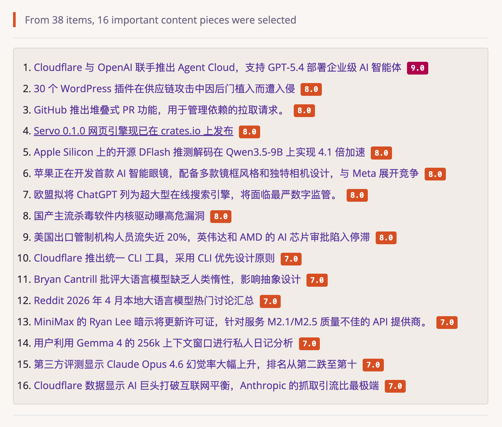
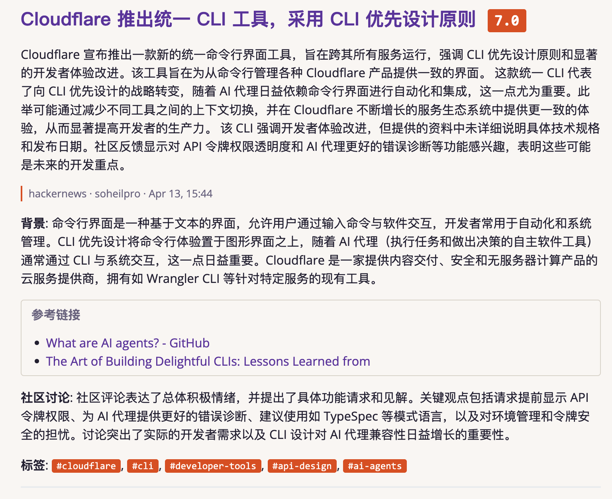
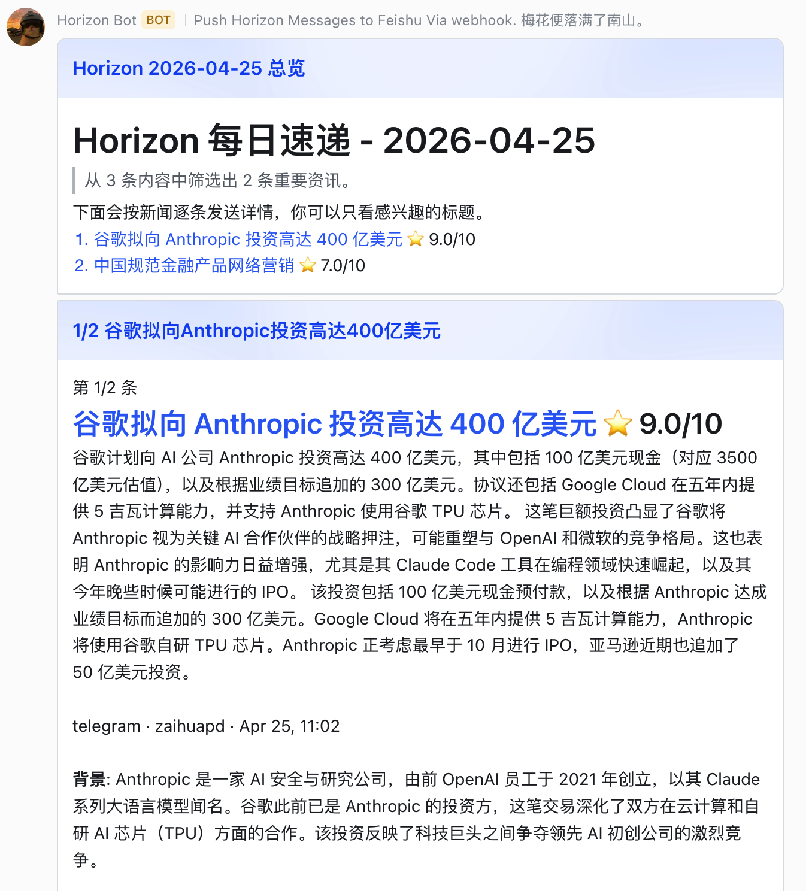
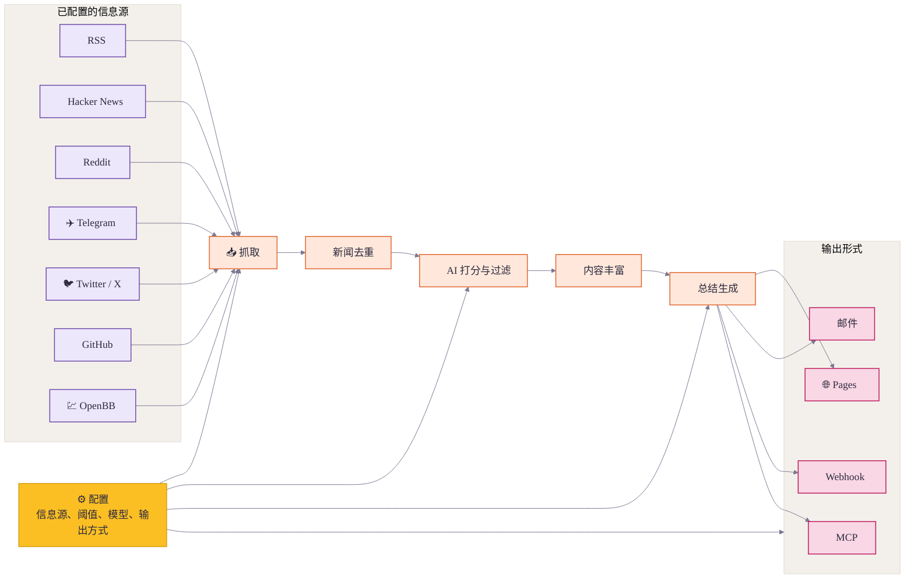

<div align="center">

<h1>🌅 Horizon</h1>

<p><strong>你只需享受新闻，剩下交给 Horizon。</strong></p>

<a href="https://trendshift.io/repositories/22864?utm_source=trendshift-badge&amp;utm_medium=badge&amp;utm_campaign=badge-trendshift-22864" target="_blank" rel="noopener noreferrer"></a>
<a href="https://trendshift.io/repositories/22864?utm_source=trendshift-badge&amp;utm_medium=badge&amp;utm_campaign=badge-trendshift-22864" target="_blank" rel="noopener noreferrer"></a>
<a href="https://hellogithub.com/repository/Thysrael/Horizon" target="_blank"></a>
<br>

[](LICENSE)
[](https://github.com/astral-sh/uv)
[](https://www.horizon1123.top/)
[](https://thysrael.github.io/Horizon/)
[](https://github.com/Thysrael/Horizon/commits/main)
[](https://github.com/Thysrael/Horizon/pulls)


![GPT](https://img.shields.io/badge/GPT-10A37F?style=flat-square&logo=data:image/svg%2bxml;base64,PHN2ZyByb2xlPSJpbWciIHZpZXdCb3g9IjAgMCAyNCAyNCIgeG1sbnM9Imh0dHA6Ly93d3cudzMub3JnLzIwMDAvc3ZnIj48cGF0aCBmaWxsPSJ3aGl0ZSIgZD0iTTIyLjI4MTkgOS44MjExYTUuOTg0NyA1Ljk4NDcgMCAwIDAtLjUxNTctNC45MTA4IDYuMDQ2MiA2LjA0NjIgMCAwIDAtNi41MDk4LTIuOUE2LjA2NTEgNi4wNjUxIDAgMCAwIDQuOTgwNyA0LjE4MThhNS45ODQ3IDUuOTg0NyAwIDAgMC0zLjk5NzcgMi45IDYuMDQ2MiA2LjA0NjIgMCAwIDAgLjc0MjcgNy4wOTY2IDUuOTggNS45OCAwIDAgMCAuNTExIDQuOTEwNyA2LjA1MSA2LjA1MSAwIDAgMCA2LjUxNDYgMi45MDAxQTUuOTg0NyA1Ljk4NDcgMCAwIDAgMTMuMjU5OSAyNGE2LjA1NTcgNi4wNTU3IDAgMCAwIDUuNzcxOC00LjIwNTggNS45ODk0IDUuOTg5NCAwIDAgMCAzLjk5NzctMi45MDAxIDYuMDU1NyA2LjA1NTcgMCAwIDAtLjc0NzUtNy4wNzI5em0tOS4wMjIgMTIuNjA4MWE0LjQ3NTUgNC40NzU1IDAgMCAxLTIuODc2NC0xLjA0MDhsLjE0MTktLjA4MDQgNC43NzgzLTIuNzU4MmEuNzk0OC43OTQ4IDAgMCAwIC4zOTI3LS42ODEzdi02LjczNjlsMi4wMiAxLjE2ODZhLjA3MS4wNzEgMCAwIDEgLjAzOC4wNTJ2NS41ODI2YTQuNTA0IDQuNTA0IDAgMCAxLTQuNDk0NSA0LjQ5NDR6bS05LjY2MDctNC4xMjU0YTQuNDcwOCA0LjQ3MDggMCAwIDEtLjUzNDYtMy4wMTM3bC4xNDIuMDg1MiA0Ljc4MyAyLjc1ODJhLjc3MTIuNzcxMiAwIDAgMCAuNzgwNiAwbDUuODQyOC0zLjM2ODV2Mi4zMzI0YS4wODA0LjA4MDQgMCAwIDEtLjAzMzIuMDYxNUw5Ljc0IDE5Ljk1MDJhNC40OTkyIDQuNDk5MiAwIDAgMS02LjE0MDgtMS42NDY0ek0yLjM0MDggNy44OTU2YTQuNDg1IDQuNDg1IDAgMCAxIDIuMzY1NS0xLjk3MjhWMTEuNmEuNzY2NC43NjY0IDAgMCAwIC4zODc5LjY3NjVsNS44MTQ0IDMuMzU0My0yLjAyMDEgMS4xNjg1YS4wNzU3LjA3NTcgMCAwIDEtLjA3MSAwbC00LjgzMDMtMi43ODY1QTQuNTA0IDQuNTA0IDAgMCAxIDIuMzQwOCA3Ljg3MnptMTYuNTk2MyAzLjg1NThMMTMuMTAzOCA4LjM2NCAxNS4xMTkyIDcuMmEuMDc1Ny4wNzU3IDAgMCAxIC4wNzEgMGw0LjgzMDMgMi43OTEzYTQuNDk0NCA0LjQ5NDQgMCAwIDEtLjY3NjUgOC4xMDQydi01LjY3NzJhLjc5Ljc5IDAgMCAwLS40MDctLjY2N3ptMi4wMTA3LTMuMDIzMWwtLjE0Mi0uMDg1Mi00Ljc3MzUtMi43ODE4YS43NzU5Ljc3NTkgMCAwIDAtLjc4NTQgMEw5LjQwOSA5LjIyOTdWNi44OTc0YS4wNjYyLjA2NjIgMCAwIDEgLjAyODQtLjA2MTVsNC44MzAzLTIuNzg2NmE0LjQ5OTIgNC40OTkyIDAgMCAxIDYuNjgwMiA0LjY2ek04LjMwNjUgMTIuODYzbC0yLjAyLTEuMTYzOGEuMDgwNC4wODA0IDAgMCAxLS4wMzgtLjA1NjdWNi4wNzQyYTQuNDk5MiA0LjQ5OTIgMCAwIDEgNy4zNzU3LTMuNDUzN2wtLjE0Mi4wODA1TDguNzA0IDUuNDU5YS43OTQ4Ljc5NDggMCAwIDAtLjM5MjcuNjgxM3ptMS4wOTc2LTIuMzY1NGwyLjYwMi0xLjQ5OTggMi42MDY5IDEuNDk5OHYyLjk5OTRsLTIuNTk3NCAxLjQ5OTctMi42MDY3LTEuNDk5N1oiLz48L3N2Zz4=)


![OpenClaw](https://img.shields.io/badge/OpenClaw-C83232?style=flat-square&logo=data:image/svg%2bxml;base64,PHN2ZyB4bWxucz0iaHR0cDovL3d3dy53My5vcmcvMjAwMC9zdmciIHdpZHRoPSI2NCIgaGVpZ2h0PSI2NCIgdmlld0JveD0iMCAwIDE2IDE2IiBhcmlhLWxhYmVsPSJQaXhlbCBsb2JzdGVyIj4KICA8cmVjdCB3aWR0aD0iMTYiIGhlaWdodD0iMTYiIGZpbGw9Im5vbmUiLz4KICAKICA8ZyBmaWxsPSIjM2EwYTBkIj4KICAgIDxyZWN0IHg9IjEiIHk9IjUiIHdpZHRoPSIxIiBoZWlnaHQ9IjMiLz4KICAgIDxyZWN0IHg9IjIiIHk9IjQiIHdpZHRoPSIxIiBoZWlnaHQ9IjEiLz4KICAgIDxyZWN0IHg9IjIiIHk9IjgiIHdpZHRoPSIxIiBoZWlnaHQ9IjEiLz4KICAgIDxyZWN0IHg9IjMiIHk9IjMiIHdpZHRoPSIxIiBoZWlnaHQ9IjEiLz4KICAgIDxyZWN0IHg9IjMiIHk9IjkiIHdpZHRoPSIxIiBoZWlnaHQ9IjEiLz4KICAgIDxyZWN0IHg9IjQiIHk9IjIiIHdpZHRoPSIxIiBoZWlnaHQ9IjEiLz4KICAgIDxyZWN0IHg9IjQiIHk9IjEwIiB3aWR0aD0iMSIgaGVpZ2h0PSIxIi8+CiAgICA8cmVjdCB4PSI1IiB5PSIyIiB3aWR0aD0iNiIgaGVpZ2h0PSIxIi8+CiAgICA8cmVjdCB4PSIxMSIgeT0iMiIgd2lkdGg9IjEiIGhlaWdodD0iMSIvPgogICAgPHJlY3QgeD0iMTIiIHk9IjMiIHdpZHRoPSIxIiBoZWlnaHQ9IjEiLz4KICAgIDxyZWN0IHg9IjEyIiB5PSI5IiB3aWR0aD0iMSIgaGVpZ2h0PSIxIi8+CiAgICA8cmVjdCB4PSIxMyIgeT0iNCIgd2lkdGg9IjEiIGhlaWdodD0iMSIvPgogICAgPHJlY3QgeD0iMTMiIHk9IjgiIHdpZHRoPSIxIiBoZWlnaHQ9IjEiLz4KICAgIDxyZWN0IHg9IjE0IiB5PSI1IiB3aWR0aD0iMSIgaGVpZ2h0PSIzIi8+CiAgICA8cmVjdCB4PSI1IiB5PSIxMSIgd2lkdGg9IjYiIGhlaWdodD0iMSIvPgogICAgPHJlY3QgeD0iNCIgeT0iMTIiIHdpZHRoPSIxIiBoZWlnaHQ9IjEiLz4KICAgIDxyZWN0IHg9IjExIiB5PSIxMiIgd2lkdGg9IjEiIGhlaWdodD0iMSIvPgogICAgPHJlY3QgeD0iMyIgeT0iMTMiIHdpZHRoPSIxIiBoZWlnaHQ9IjEiLz4KICAgIDxyZWN0IHg9IjEyIiB5PSIxMyIgd2lkdGg9IjEiIGhlaWdodD0iMSIvPgogICAgPHJlY3QgeD0iNSIgeT0iMTQiIHdpZHRoPSI2IiBoZWlnaHQ9IjEiLz4KICA8L2c+CgogIAogIDxnIGZpbGw9IiNmZjRmNDAiPgogICAgPHJlY3QgeD0iNSIgeT0iMyIgd2lkdGg9IjYiIGhlaWdodD0iMSIvPgogICAgPHJlY3QgeD0iNCIgeT0iNCIgd2lkdGg9IjgiIGhlaWdodD0iMSIvPgogICAgPHJlY3QgeD0iMyIgeT0iNSIgd2lkdGg9IjEwIiBoZWlnaHQ9IjEiLz4KICAgIDxyZWN0IHg9IjMiIHk9IjYiIHdpZHRoPSIxMCIgaGVpZ2h0PSIxIi8+CiAgICA8cmVjdCB4PSIzIiB5PSI3IiB3aWR0aD0iMTAiIGhlaWdodD0iMSIvPgogICAgPHJlY3QgeD0iNCIgeT0iOCIgd2lkdGg9IjgiIGhlaWdodD0iMSIvPgogICAgPHJlY3QgeD0iNSIgeT0iOSIgd2lkdGg9IjYiIGhlaWdodD0iMSIvPgogICAgPHJlY3QgeD0iNSIgeT0iMTIiIHdpZHRoPSI2IiBoZWlnaHQ9IjEiLz4KICAgIDxyZWN0IHg9IjYiIHk9IjEzIiB3aWR0aD0iNCIgaGVpZ2h0PSIxIi8+CiAgPC9nPgoKICAKICA8ZyBmaWxsPSIjZmY3NzVmIj4KICAgIDxyZWN0IHg9IjEiIHk9IjYiIHdpZHRoPSIyIiBoZWlnaHQ9IjEiLz4KICAgIDxyZWN0IHg9IjIiIHk9IjUiIHdpZHRoPSIxIiBoZWlnaHQ9IjEiLz4KICAgIDxyZWN0IHg9IjIiIHk9IjciIHdpZHRoPSIxIiBoZWlnaHQ9IjEiLz4KICAgIDxyZWN0IHg9IjEzIiB5PSI2IiB3aWR0aD0iMiIgaGVpZ2h0PSIxIi8+CiAgICA8cmVjdCB4PSIxMyIgeT0iNSIgd2lkdGg9IjEiIGhlaWdodD0iMSIvPgogICAgPHJlY3QgeD0iMTMiIHk9IjciIHdpZHRoPSIxIiBoZWlnaHQ9IjEiLz4KICA8L2c+CgogIAogIDxnIGZpbGw9IiMwODEwMTYiPgogICAgPHJlY3QgeD0iNiIgeT0iNSIgd2lkdGg9IjEiIGhlaWdodD0iMSIvPgogICAgPHJlY3QgeD0iOSIgeT0iNSIgd2lkdGg9IjEiIGhlaWdodD0iMSIvPgogIDwvZz4KICA8ZyBmaWxsPSIjZjVmYmZmIj4KICAgIDxyZWN0IHg9IjYiIHk9IjQiIHdpZHRoPSIxIiBoZWlnaHQ9IjEiLz4KICAgIDxyZWN0IHg9IjkiIHk9IjQiIHdpZHRoPSIxIiBoZWlnaHQ9IjEiLz4KICA8L2c+Cjwvc3ZnPgoK)


📡 构建你专属的 AI 新闻雷达，生成中英双语日报。 | Your own AI-powered news radar.

[📖 在线演示](https://thysrael.github.io/Horizon/) · [📋 配置指南](https://thysrael.github.io/Horizon/configuration) · [English](README.md) · [日本語](README_ja.md)

</div>

## 截图

<table>
<tr>
<td width="50%">
<p align="center"><strong>按优先级排序的日报</strong></p>

</td>
<td width="50%">
<p align="center"><strong>背景、总结与评论</strong></p>

</td>
</tr>
</table>

<details>
<summary><strong>More Screenshots</strong></summary>
<br>
<table>
<tr>
<td width="33.33%">
<p align="center"><strong>终端输出</strong></p>

</td>
<td width="33.33%">
<p align="center"><strong>飞书通知</strong></p>

</td>
<td width="33.33%">
<p align="center"><strong>邮件推送</strong></p>

</td>
</tr>
</table>
</details>

## 为什么需要 Horizon？

好新闻分散在各处，坏信息却源源不断。Horizon 为你先完成第一轮筛选：从 Hacker News、Reddit、Telegram、RSS、Twitter/X、GitHub 和 OpenBB 抓取内容，合并重复新闻，用 AI 打分过滤，并为重要内容补充背景解释和社区讨论。

但 Horizon 不只是又一个摘要工具。AI 很擅长降低噪声，但新闻仍然需要人的品味：你信任哪些信息源，哪些评论改变了你对事件的理解，哪些小众来源值得被更多人看见。Horizon 通过可定制的信息源、筛选标准、模型、语言、分发方式、评论摘要和社区信息源官网，把这层“人味”保留下来。

## 功能特性

- **📡 关注你的信息源** — 将 Hacker News、RSS、Reddit、Telegram、Twitter/X、GitHub Release / 用户动态，以及 OpenBB 金融新闻观察列表纳入同一条 pipeline
- **🤖 把噪声变成阅读清单** — 使用 Claude、GPT、Gemini、DeepSeek、豆包、MiniMax 或任意 OpenAI 兼容 API，为每条内容评分 0-10
- **🔗 合并重复新闻** — 在生成日报前自动合并来自不同平台的相同故事
- **🔍 补全背景知识** — 为陌生概念、公司、项目和技术术语补充网络搜索得到的背景解释
- **💬 读到社区声音** — 收集并总结 Hacker News、Reddit 等来源的评论讨论
- **🌐 生成双语日报** — 基于同一组信息源生成英文和中文日报
- **📝 发布日报站点** — 将生成的 Markdown 发布为 GitHub Pages 静态日报站点
- **📧 邮件分发** — 运行自托管 SMTP/IMAP 邮件列表，自动处理订阅与退订
- **🔔 推送到聊天和自动化工具** — 将模板化结果发送到飞书、钉钉、Slack、Discord 或自定义 Webhook
- **🧙 从兴趣开始配置** — 通过交互式向导根据你的兴趣生成个性化信息源配置
- **⚙️ 调校你的新闻雷达** — 在单个 JSON 配置中定制信息源、阈值、模型、语言和分发方式

## 工作原理



1. **定义** — 用一个 JSON 配置好信息源、阈值、模型、语言和分发方式。
2. **抓取** — 并发拉取所有已配置信息源的最新内容。
3. **去重** — 合并来自不同平台、指向同一故事或 URL 的内容。
4. **打分与过滤** — 用 AI 对内容排序，只保留超过阈值的条目。
5. **丰富** — 为重要内容补充搜索得到的背景信息和社区讨论。
6. **总结** — 生成结构化的 Markdown 日报，包含摘要、标签和参考链接。
7. **分发** — 将结果发布到 GitHub Pages、邮件、飞书等 webhook、MCP 或本地文件。

## 赞助

Horizon 是一个业余时间维护的开源项目。如果你愿意支持这个项目，或希望出现在这里，欢迎[创建一个 Issue](https://github.com/Thysrael/Horizon/issues/new) 或[发邮件](mailto:thysrael@163.com)联系我。

| 支持方 | 说明 |
|--------|------|
| [](https://www.compshare.cn/?ytag=GPU_YY_git_Horizon) | 优云智算目前正在支持 Horizon。优云智算是 UCloud 旗下 AI 云平台，主打包月、按次的高性价比国模 Agent Plan 套餐，低至 49 元/月起，同时提供官转稳定海外模型。支持接入 Claude Code、Codex 及 API 调用，支持企业高并发、7*24 技术支持和自助开票。<br><br>通过其[链接](https://www.compshare.cn/?ytag=GPU_YY_git_Horizon)注册，可获得 5 元平台体验金。 |

## 快速开始

### 1. 安装

#### 方式 A：本地安装

```bash
git clone https://github.com/Thysrael/Horizon.git
cd horizon

# 使用 uv 安装（推荐）
uv sync

# 需要测试/开发依赖时
uv sync --extra dev

# 或使用 pip
pip install -e .
```

当前 `dev` 在 `pyproject.toml` 中定义为 optional extra，因此安装 `pytest` 等开发依赖时应使用 `uv sync --extra dev`。

如果你要启用可选的 OpenBB 金融新闻源，还需要安装对应 extra：

```bash
uv sync --extra openbb
```

如果 `openbb` 在你的机器上会拉到缺少 wheel 的依赖，建议改用只安装二进制包：

```bash
uv pip install --only-binary=:all: openbb openbb-benzinga
```

#### 方式 B：Docker

```bash
git clone https://github.com/Thysrael/Horizon.git
cd horizon

# 配置环境
cp .env.example .env
cp data/config.example.json data/config.json
# 编辑 .env 和 data/config.json，填入你的 API 密钥和偏好设置

# 使用 Docker Compose 运行
docker compose run --rm horizon

# 或自定义时间窗口
docker compose run --rm horizon --hours 48
```

### 2. 配置

**方式 A：交互式向导（推荐）**

```bash
uv run horizon-wizard
```

向导会询问你的兴趣（如"LLM 推理"、"嵌入式"、"web 安全"），自动推荐并生成 `data/config.json`，还可选让 AI 补充推荐小众源。若你想分享信息源，请前往 [horizon1123.top](https://horizon1123.top/)。

**方式 B：手动配置**

```bash
cp .env.example .env          # 添加 API 密钥
cp data/config.example.json data/config.json  # 自定义信息源
```

最小手动配置示例：

```jsonc
{
  "ai": {
    "provider": "openai",
    "model": "gpt-4",
    "api_key_env": "OPENAI_API_KEY"
  },
  "sources": {
    "rss": [
      { "name": "Simon Willison", "url": "https://simonwillison.net/atom/everything/" }
    ]
  },
  "filtering": {
    "ai_score_threshold": 6.0
  }
}
```

**均衡日报（可选）**

可以限制日报总条数，并避免单一类别占据过多内容。类别来自
`sources.rss[].category` 等信息源配置。

```jsonc
{
  "filtering": {
    "ai_score_threshold": 6.0,
    "max_items": 20,
    "category_groups": {
      "ai": {
        "limit": 5,
        "categories": ["ai-news", "ai-tools", "machine-learning"]
      },
      "finance": {
        "limit": 5,
        "categories": ["finance", "business", "equities"]
      }
    },
    "default_group": "other",
    "default_group_limit": 3
  }
}
```

分组限额在 AI 分数过滤之后、内容补充之前执行。未配置
`category_groups` 和 `max_items` 时，筛选行为保持不变。

`data/config.json` 里的任意字符串值都可以通过 `${VAR_NAME}` 引用环境变量。这适合用于 `ai.base_url`、私有 RSS 链接、Webhook 地址或自定义请求头模板等字段。

完整配置参考请查看[配置指南](docs/configuration.md)。

### 3. 运行

#### 本地安装

```bash
uv run horizon              # 使用默认 24 小时窗口
uv run horizon --hours 48   # 抓取最近 48 小时的内容
```

#### 使用 Docker

```bash
docker compose run --rm horizon              # 使用默认 24 小时窗口
docker compose run --rm horizon --hours 48   # 抓取最近 48 小时的内容
```

生成的日报将保存在 `data/summaries/` 目录中。

### 4. 自动化（可选）

Horizon 非常适合作为 **GitHub Actions** 定时任务运行。查看 [`.github/workflows/daily-summary.yml`](.github/workflows/daily-summary.yml) 获取现成的工作流配置，可自动生成日报并部署到 GitHub Pages。

## 支持的信息源

| 信息源 | 抓取内容 | 评论收集 |
|--------|---------|---------|
| **Hacker News** | 按分数排序的热门文章 | 支持（前 N 条评论） |
| **RSS / Atom** | 任意 RSS 或 Atom 订阅源 | — |
| **Reddit** | Subreddit 帖子 + 用户动态 | 支持（前 N 条评论） |
| **Telegram** | 公开频道消息 | — |
| **Twitter / X** | 特定用户的推文 | 支持（前 N 条回复） |
| **GitHub** | 用户动态 & 仓库 Release | — |
| **OpenBB** | 按观察列表 / provider 抓取金融公司新闻 | — |

## 日报可以去哪里

Horizon 支持通过多种方式发布和分发生成的日报：

| 方式 | 作用 |
|------|------|
| **GitHub Pages 日报站点** | 将生成的 Markdown 复制到 `docs/`，通过 GitHub Pages 发布为每日更新的静态日报站点 |
| **邮件订阅** | 通过 SMTP/IMAP 向订阅者发送日报，并自动处理订阅/退订请求 |
| **Webhook 通知** | 在成功或失败时将结果推送到飞书、钉钉、Slack、Discord 或任意 Webhook 端点 |
| **MCP Server** | 将抓取、打分、过滤、富化、摘要和完整 pipeline 暴露为工具，供 AI 助手调用 |

具体配置见[配置指南](docs/configuration.md)。MCP 工具说明和客户端接入见 [`src/mcp/README.md`](src/mcp/README.md) 与 [`src/mcp/integration.md`](src/mcp/integration.md)。

## 文档

| 文档 | 内容 |
|------|------|
| [配置指南](docs/configuration.md) | AI 模型、信息源、过滤、邮件、Webhook、GitHub Pages 和 MCP 配置 |
| [评分机制](docs/scoring.md) | Horizon 如何评估和排序新闻 |
| [抓取器](docs/scrapers.md) | 信息源抓取器说明和扩展细节 |
| [MCP 工具](src/mcp/README.md) | MCP 客户端可调用的工具说明 |

## 项目状态

Horizon 已经支持完整的日报流程：多源抓取、AI 打分、去重、背景补充、评论摘要、双语生成、GitHub Pages 发布、邮件分发、Webhook 推送、Docker 部署、MCP 集成和配置向导。

计划中的改进：

- 更多信息源类型，例如 Discord
- 按信息源自定义打分 Prompt
- 在 GitHub 上发布 Release
- 发布到 PyPI，支持通过 `pip install` 安装

## 贡献

欢迎贡献！请随时提交 Issue 或 Pull Request。

### 分享信息源

想把有价值的信息源分享给 Horizon 社区？请直接前往 **[horizon1123.top](https://horizon1123.top)** 提交。

欢迎提交：你所在领域里优质的小众 RSS 发现、活跃 subreddit 的趋势、值得关注的 GitHub 动态，或 Telegram 频道精选内容。

## 鸣谢

- 特别感谢 [LINUX.DO](https://linux.do/) 提供的宣传平台。
- 特别感谢 [HelloGitHub](https://hellogithub.com/) 提供的指导意见。
- 特别感谢 [AIGC Link](https://xhslink.com/m/80ngts127cA) 提供的小红书和微信公众号宣传。

## 许可证

[MIT](LICENSE)
